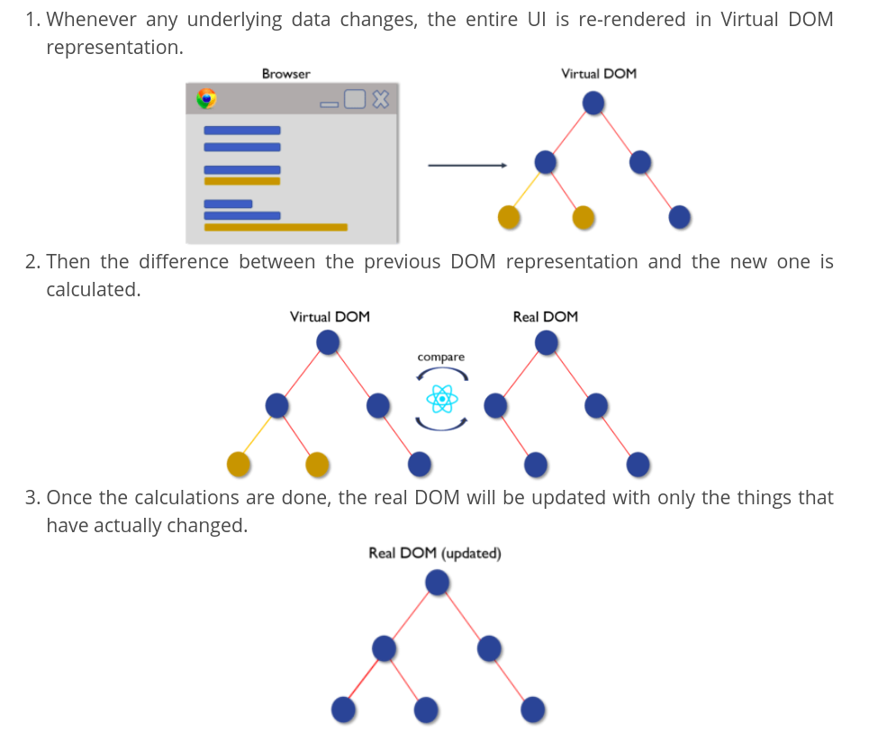

# React Interview Questions

### React Interview Questions

1-Differentiate between Real DOM and Virtual DOM.

| Real DOM | Virtual  DOM |
| - | - |
|1. It updates slow.|	1. It updates faster.|
|2. Can directly update HTML.|	2. Can’t directly update HTML.|
|3. Creates a new DOM if element updates.|	3. Updates the JSX if element updates.|
|4. DOM manipulation is very expensive.|	4. DOM manipulation is very easy.|
|5. Too much of memory wastage.|	5. No memory wastage.|

---

2-What is React?

- React is a front-end JavaScript library developed by Facebook in 2011.
- It follows the component based approach which helps in building reusable UI components.
- It is used for developing complex and interactive web and mobile UI.
- Even though it was open-sourced only in 2015, it has one of the largest communities supporting it.

---

3-What are the features of React? 

Major features of React are listed below:

- It uses the virtual DOM instead of the real DOM.
- It uses server-side rendering.
- It follows uni-directional data flow or data binding.

---

4-List some of the major advantages of React.

Some of the major advantages of React are:

- It increases the application’s performance
- It can be conveniently used on the client as well as server side
- Because of JSX, code’s readability increases
- React is easy to integrate with other frameworks like Meteor, Angular, etc
- Using React, writing UI test cases become extremely easy

---

5-What are the limitations of React?

Limitations of React are listed below:

React is just a library, not a full-blown framework
Its library is very large and takes time to understand
It can be little difficult for the novice programmers to understand
Coding gets complex as it uses inline templating and JSX

---

6-What is JSX?

JSX is a shorthand for JavaScript XML. This is a type of file used by React which utilizes the expressiveness of JavaScript along with HTML like template syntax. This makes the HTML file really easy to understand. This file makes applications robust and boosts its performance. Below is an example of JSX:

```js
render(){
    return(        
          
<div>
             
<h1> Hello World from Edureka!!</h1>
 
         </div>
 
    );
}
```

---

7-What do you understand by Virtual DOM? Explain its working.

A virtual DOM is a lightweight JavaScript object which originally is just the copy of the real DOM. It is a node tree that lists the elements, their attributes and content as Objects and their properties. React’s render function creates a node tree out of the React components. It then updates this tree in response to the mutations in the data model which is caused by various actions done by the user or by the system.
This Virtual DOM works in three simple steps.



---

8-Why can’t browsers read JSX?

Browsers can only read JavaScript objects but JSX in not a regular JavaScript object. Thus to enable a browser to read JSX, first, we need to transform JSX file into a JavaScript object using JSX transformers like Babel and then pass it to the browser.

---

9-How different is React’s ES6 syntax when compared to ES5?

Syntax has changed from ES5 to ES6 in following aspects:

require vs import

```js
// ES5
var React = require('react');
 
// ES6
import React from 'react';
```

export vs exports

```js
// ES5
module.exports = Component;
 
// ES6
export default Component;
```

component and function

```js
// ES5
var MyComponent = React.createClass({
    render: function() {
        return
 
<h3>Hello Edureka!</h3>
;
    }
});
 
// ES6
class MyComponent extends React.Component {
    render() {
        return
 
<h3>Hello Edureka!</h3>
;
    }
}
```

props

```js
// ES5
var App = React.createClass({
    propTypes: { name: React.PropTypes.string },
    render: function() {
        return
 
<h3>Hello, {this.props.name}!</h3>
;
    }
});
 
// ES6
class App extends React.Component {
    render() {
        return
 
<h3>Hello, {this.props.name}!</h3>
;
    }
}
```

state

```js
// ES5
var App = React.createClass({
    getInitialState: function() {
        return { name: 'world' };
    },
    render: function() {
        return
 
<h3>Hello, {this.state.name}!</h3>
;
    }
});
 
// ES6
class App extends React.Component {
    constructor() {
        super();
        this.state = { name: 'world' };
    }
    render() {
        return
 
<h3>Hello, {this.state.name}!</h3>
;
    }
}
```

---

10-How is React different from Angular?

React vs Angular

| TOPIC | REACT |	ANGULAR |
| - | - | - |
| 1. ARCHITECTURE|	Only the View of MVC|	Complete MVC|
| 2. RENDERING|	Server-side rendering|	Client-side rendering|
| 3. DOM|	Uses virtual DOM|	Uses real DOM|
| 4. DATA BINDING|	One-way data binding|	Two-way data binding|
| 5. DEBUGGING|	Compile time debugging|	Runtime debugging|
| 6. AUTHOR|	Facebook|	Google|

---

## React Components Interview Questions

---

11-“In React, everything is a component.” Explain.

Components are the building blocks of a React application’s UI. These components split up the entire UI into small independent and reusable pieces. Then it renders each of these components independent of each other without affecting the rest of the UI.

---

12-What is the purpose of `render()` in React.

Each React component must have a `render()` mandatorily. It returns a single React element which is the representation of the native DOM component. If more than one HTML element needs to be rendered, then they must be grouped together inside one enclosing tag such as `<form>`, `<group>`,`<div>` etc. This function must be kept pure i.e., it must return the same result each time it is invoked.

---

13-How can you embed two or more components into one?

We can embed components into one in the following way:

```js

class MyComponent extends React.Component{
    render(){
        return(          
             
<div>
               
<h1>Hello</h1>
 
                <Header/>
            </div>
 
        );
    }
}
class Header extends React.Component{
    render(){
        return
 
<h1>Header Component</h1>
   
   };
}
ReactDOM.render(
    <MyComponent/>, document.getElementById('content')
);
```

---


---

---


---